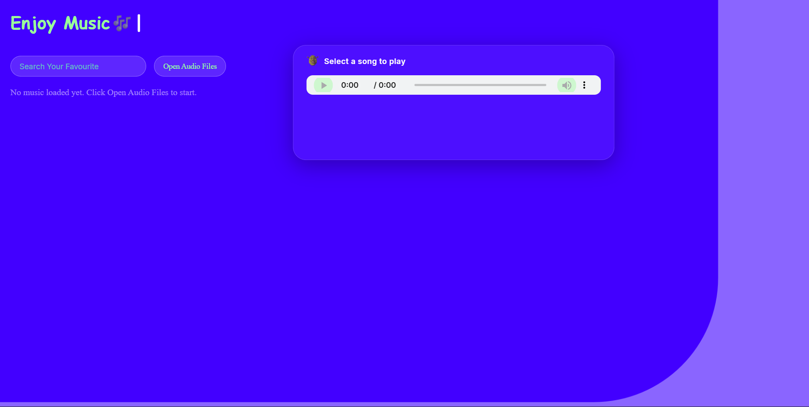

# Best Juke box - JukeSquare

Hey this is a music player app build maninly for saloons, who doesnt get enough costumers. So basically this JukeSquare will improve your constumers mood and mind and you can play cool music in you choice without anyy interuptions like ad and more

# Previews 

# How can you use it ?

-Clone this Repo 
-Open the code with your code editor(I prefer Vs code). 
-If you dont know how to open a cloned code you can use github desktop for that task 
-Install live server extension from the extensions tab in VS code 
-Then you can right click inside your index.html file and preview it :D 
-Dont send it to your friends its a local server (means only you an see it) 
